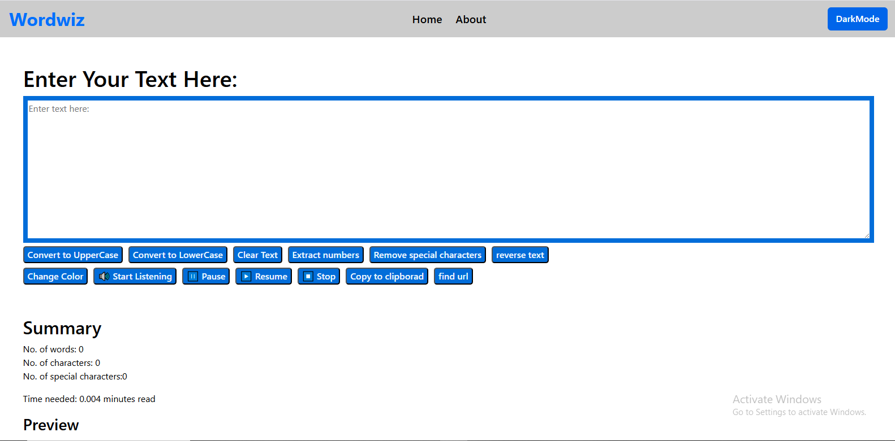
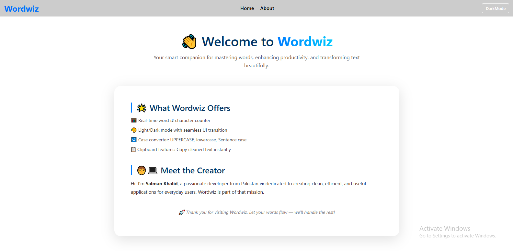

# 📝 WordsWiz

**WordsWiz** is a sophisticated and interactive text editor developed using React. This application provides a comprehensive suite of text manipulation tools, real-time analytics, and voice features, making it an essential tool for anyone who works with text. Whether you need to edit, analyze, or listen to your text, WordsWiz offers a seamless and intuitive user experience.

---

## 🚀 Features

### ✍️ Text Editing Tools

- **Text Transformation**: Convert text to **UPPERCASE** or **lowercase** effortlessly.
- **Text Manipulation**: Reverse any text input or clear all content with a single click.
- **Data Extraction**: Remove special characters, extract numbers, and URLs from your text, copying them directly to your clipboard.
- **Clipboard Operations**: Easily copy all content with one click.

### 🎨 Style & Appearance

- **Dynamic Color Change**: Change the text color in real-time by entering a color name.
- **Customizable Themes**: Support for customizable themes via the `mystyle` prop.

### 🔊 Speech Controls

- **Speech Synthesis**: Start reading your text aloud using the browser's speech synthesis capabilities.
- **Playback Controls**: Pause, resume, or stop speech playback as needed.

### 📊 Real-Time Text Summary

- **Analytics**: Get real-time statistics on word count, character count, and special character count.
- **Estimated Reading Time**: Calculate the estimated reading time based on the text length.
- **Live Preview**: View a live preview of your text as you edit.

---

## 📸 Preview

   ```markdown
   
   
   .png)
   .png)

   ```

---

## 📦 Installation

### Prerequisites

- Ensure you have [Node.js](https://nodejs.org/) and npm installed on your machine.

### Clone the Repository

```bash
git clone https://github.com/salmankhalid7/Wordswiz.git
cd Wordswiz
```

### Install Dependencies

```bash
npm install
```

### Start the Application

```bash
npm start
```

Open your browser and navigate to `http://localhost:3000` to view the application.

---

## 🧠 Tech Stack

- **Framework**: React.js
- **Language**: JavaScript
- **Styling**: CSS (with support for props-based dynamic styling)
- **Web APIs**: Web Speech API, Clipboard API

---

## 📁 Project Structure

```
/Wordswiz
│
├── /src
│   ├── Form.js         # Main text editor component
│   ├── Form.css        # Styles for the editor
│   └── App.js          # App entry component
│
├── /assets              # Folder for images and assets
│   └── preview.png     # Example image
│
├── package.json
└── README.md
```

---

## 🙌 Contributing

Contributions, issues, and feature requests are welcome! To contribute:

1. Fork the repository.
2. Create your feature branch (`git checkout -b feature/YourFeature`).
3. Commit your changes (`git commit -m 'Add your feature'`).
4. Push to the branch (`git push origin feature/YourFeature`).
5. Create a Pull Request.

---

## 📄 License

This project is licensed under the **MIT License**. See the [LICENSE](LICENSE) file for details.

---

## 👤 Author

**Salman Khalid**  
GitHub: [@salmankhalid7](https://github.com/salmankhalid7)  
Email: [m.salmankhalid123@gmail.com](mailto:m.salmankhalid123@gmail.com)

---

## 🌐 Live Demo

[](https://salmankhalid7.github.io/Wordswiz/)
